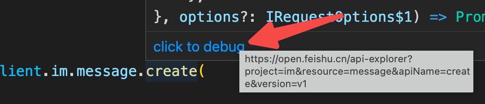
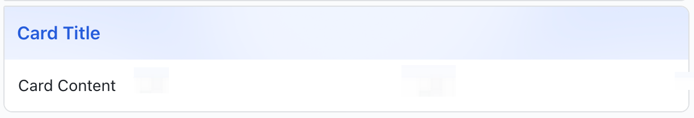

# 飞书开放接口SDK


[English](https://github.com/larksuite/node-sdk/blob/main/README.md)
## 概述
[飞书开放平台](https://open.feishu.cn/document/ukTMukTMukTM/uITNz4iM1MjLyUzM)提供了一系列服务端的原子api来实现多元化的功能，但在实际编码过程中感受不是很顺畅，原因在于使用这些api完成功能时，需要考虑很多额外的工作，如token的获取及其维护、数据加解密、请求的验签等等；再者，在实际编码过程中，少了函数调用的语义化描述，类型系统的支持，使得心智负担过重。

凡此种种，都使得整体的开发体验不佳，基于此，为了让开放能力变得易用，我们编写了该SDK，将所有冗长的逻辑内置处理，提供完备的类型系统，对外提供语义化的编程接口，提高编码体验。😙

以下是一些基于该sdk的官方教程：
* [快速开发互动卡片](https://open.feishu.cn/document/home/quickly-develop-interactive-cards/introduction)
* [快速开发人员及考勤管理系统](https://open.feishu.cn/document/home/quick-start-of-personnel-and-attendance-management-system/overview)
* [快速接入多维表格](https://open.feishu.cn/document/home/quick-access-to-base/preparation)
* [基于网页应用实现部门人员管理](https://open.feishu.cn/document/home/quick-access-to-base/department-personnel-management-based-on-web-app/overview)
* [快速接入通讯录](https://open.feishu.cn/document/home/quick-access-to-contact-api/introduction)
* [基于审批实现自动考勤管理](https://open.feishu.cn/document/home/automatic-attendance-management-based-on-approval/introduction)

## 概念
- 开发文档：开放平台的开放接口的参考，**开发者必看，可以使用搜索功能，高效的查询文档**。[更多介绍说明](https://open.feishu.cn/document/) 。

- 开发者后台：开发者开发应用的管理后台，[更多介绍说明](https://open.feishu.cn/app/) 。

- 企业自建应用：应用仅仅可在本企业内安装使用，[更多介绍说明](https://open.feishu.cn/document/uQjL04CN/ukzM04SOzQjL5MDN) 。

- 应用商店应用：应用会在 [应用目录](https://app.feishu.cn/?lang=zh-CN)
  展示，各个企业可以选择安装，[更多介绍说明](https://open.feishu.cn/document/uQjL04CN/ugTO5UjL4kTO14CO5kTN) 。

## 安装
npm
```shell script
npm install @larksuiteoapi/node-sdk
```
yarn
```
yarn add @larksuiteoapi/node-sdk
```

## 如何使用
提供ECMAScript，CommonJS2个版本，支持原生Javascript和Typescript的使用，示例均以Typescript为例。

Typescript
```typescript
import * as lark from '@larksuiteoapi/node-sdk';
```
CommonJS
```javascript
const lark = require('@larksuiteoapi/node-sdk');
```
ECMAScript
```javascript
import * as lark from '@larksuiteoapi/node-sdk';
```
### api调用
飞书开放平台开放的所有 API 列表，可点击[这里查看](https://open.feishu.cn/document/ukTMukTMukTM/uYTM5UjL2ETO14iNxkTN/server-api-list)。

SDK提供了语义化的调用方式，只需要依据相关参数构造出client实例，接着使用其上的语义化方法（*client.业务域.资源.方法*）即可完成api调用，调用过程及调用结果均有完备的类型进行提示，如向群聊中发送消息：
```typescript
import * as lark from '@larksuiteoapi/node-sdk';

const client = new lark.Client({
    appId: 'app id',
    appSecret: 'app secret',
    appType: lark.AppType.SelfBuild,
    domain: lark.Domain.Feishu,
});

const res = await client.im.message.create({
    params: {
        receive_id_type: 'chat_id',
    },
    data: {
        receive_id: 'receive_id',
        content: JSON.stringify({text: 'hello world'}),
        msg_type: 'text',
  },
});
```
> tips: 
> * 如果想调试某个api，可以点击注释中的链接进入api调试台进行调试：
> 
> * 如何获取语义化调用接口：[点击这里](https://github.com/larksuite/node-sdk/issues/42)

#### 创建client
对于自建应用，可以使用下面的代码创建一个client：

```typescript
import * as lark from '@larksuiteoapi/node-sdk';

const client = new lark.Client({
    appId: 'app id',
    appSecret: 'app secret'
});
```

对于商店应用，需要显示的指定appType为lark.AppType.ISV：
```typescript
import * as lark from '@larksuiteoapi/node-sdk';

const client = new lark.Client({
    appId: 'app id',
    appSecret: 'app secret',
    appType: lark.AppType.ISV,
});
```
**使用创建好的商店应用的client发起api调用时，还需在请求时手动传递[tenant_key](https://open.feishu.cn/document/ukTMukTMukTM/ukDNz4SO0MjL5QzM/g#d15ab5d)**，可以使用lark.withTenantKey来完成：
```typescript
client.im.message.create({
    params: {
        receive_id_type: 'chat_id',
    },
    data: {
        receive_id: 'chat_id',
        content: JSON.stringify({text: 'hello world'}),
        msg_type: 'text'
    },
}, lark.withTenantKey('tenant key'));
```

#### `Client`构造参数：
|  参数   | 描述  | 类型 | 必须 | 默认 |
|  ----  | ----  | ---- | ---- | ---- |
| appId  | 应用的id | string | 是 | - |
| appSecret  | 应用的密码 | string | 是 | - |
| domain  | 应用的域，分为飞书（https://open.feishu.cn）、lark（https://open.larksuite.com）、其它（需要传递完整的域名） | Domain &#124; string | 否 | Domain.Feishu |
| httpInstance | sdk发送请求的http实例。*sdk内部默认使用axios.create()构造出一个defaultHttpInstance来进行http调用。*| HttpInstance | 否 | defaultHttpInstance。*可以从sdk中import它，在其上添加interceptors来完成业务需求。* |
| loggerLevel  | 日志级别 | LoggerLevel | 否 | info |
| logger  | - | Logger | 否 | - |
| cache  | 缓存器 | Cache | 否 | - |
| disableTokenCache  | 是否禁用缓存，如若禁用，则token等不会进行缓存，每次需要使用时都会重新拉取 | boolean | 否 | false |
| appType  | 应用的类型，分为商店应用或者自建应用 | AppType | 否 | AppType.SelfBuild |
| helpDeskId  | 服务台id | string | 否 | - |
| helpDeskToken  | 服务台token | string | 否 | - |

#### 分页
针对返回值以分页形式呈现的接口，对其提供了迭代器方式的封装（方法名后缀为WithIterator），提高易用性，消弭了根据page_token来反复获取数据的繁琐操作，如获取用户列表：
``` typescript
// 每次处理20条数据
for await (const items of await client.contact.user.listWithIterator({
    params: {
        department_id: '0',
        page_size: 20,
    },
})) {
    console.log(items);
}

// 也可用next来手动控制迭代，每次取20条数据
const listIterator = await SDKClient.contact.user.listWithIterator({
    params: {
        department_id: '0',
        page_size: 20,
    },
});
const { value } = await listIterator[Symbol.asyncIterator]().next();
console.log(value);
```
*当然也可以使用无迭代器封装的版本，这时候需要自己每次根据返回的page_token来手动进行分页调用。*
#### 文件上传
和调用普通api的方式一样，按类型提示传递参数即可，内部封装了对文件上传的处理，如：
```typescript
const res = await client.im.file.create({
    data: {
        file_type: 'mp4',
        file_name: 'test.mp4',
        file: fs.readFileSync('file path'),
    },
});
```
#### 文件下载
对返回的二进制流进行了封装，消弭了对流本身的处理，只需调用writeFile方法即可将数据写入文件，如：
```typescript
const resp = await client.im.file.get({
    path: {
        file_key: 'file key',
    },
});
await resp.writeFile(`filepath.suffix`);
```
如果想要自定义对流的处理，可以调用getReadableStream方法获取到流，如将流写入文件：
```typescript
import * as fs from 'fs';

const resp = await client.im.file.get({
    path: {
        file_key: 'file key',
    },
});
const readableStream = resp.getReadableStream();
const writableStream = fs.createWriteStream('file url');
readableStream.pipe(writableStream);
```
> 注意：流只能被消费一次，即如果使用了writeFile消费了流，则getReadableStream获取流会报错/获取到的流为空；如需消费多次流，可以使用getReadableStream获取流，然后读取流中的数据做缓存，将缓存的数据给消费方使用。

#### 普通调用
某些老版本的开放接口，无法生成对应的语义化调用方法，需要使用client上的request方法来进行手动调用：
```typescript
import * as lark from '@larksuiteoapi/node-sdk';

const client = new lark.Client({
    appId: 'app id',
    appSecret: 'app secret',
    appType: lark.AppType.SelfBuild,
    domain: lark.Domain.Feishu,
});

const res = await client.request({
    method: 'POST',
    url: 'xxx',
    data: {},
    params: {},
});
```
#### 消息卡片
在发送[消息卡片](https://open.feishu.cn/document/ukTMukTMukTM/uczM3QjL3MzN04yNzcDN)信息时，会先在[消息卡片搭建工具](https://open.feishu.cn/document/ukTMukTMukTM/uYzM3QjL2MzN04iNzcDN/message-card-builder)中搭建出消息卡片的模版，拿到生成的模版json，用数据替换其中内容相关的部分，将结果作为支持消息卡片api的参数来使用。如发送一个简单的具有`title`和`content`的消息卡片：
```typescript
client.im.message.create({
  params: {
    receive_id_type: 'chat_id',
  },
  data: {
    receive_id: 'your receive_id',
    content: JSON.stringify({
        "config": {
          "wide_screen_mode": true
        },
        "elements": [
          {
            "tag": "markdown",
            "content": "Card Content"
          }
        ],
        "header": {
          "template": "blue",
          "title": {
            "content": "Card Title",
            "tag": "plain_text"
          }
        }
      }
    ),
    msg_type: 'interactive'
  }
})
```

这样使用会有一个问题：**如果消息卡片内容比较丰富，生成的模版json比较大，与之相关需要数据填充的内容部分也会比较多，手动维护比较繁琐**。针对这个问题，开放平台提供了[模版消息](https://open.feishu.cn/document/tools-and-resources/message-card-builder#3e1f2c7c)的能力，发送消息卡片时只需要提供模版id和模版的数据内容即可。sdk对这个能力进行了调用上的封装，支持消息卡片的接口会同步的增加一个ByCard的调用方式，只需要传递`template_id`和`template_variable`即可。如上面的调用可以改写成：
```typescript
client.im.message.createByCard({
  params: {
    receive_id_type: 'chat_id',
  },
  data: {
    receive_id: 'your receive_id',
    template_id: 'your template_id',
    template_variable: {
      content: "Card Content",
      title: "Card Title"
    }
  }
});
```
如果想要快速体验消息卡片，可以使用sdk中内置的一个基础卡片:
```typescript
import * as lark from '@larksuiteoapi/node-sdk';

client.im.message.create({
  params: {
    receive_id_type: 'chat_id',
  },
  data: {
    receive_id: 'your receive_id',
    content: lark.messageCard.defaultCard({
      title: 'Card Title',
      content: 'Card Content'
    }),
    msg_type: 'interactive'
  }
})
```
效果同上：


#### 配置请求选项
如果想在api调用过程中修改请求的参数，如携带一些header，自定义tenantToken等，则可以使用请求方法的第二个参数来进行修改：
```typescript
await client.im.message.create({
    params: {
        receive_id_type: 'chat_id',
    },
    data: {
        receive_id: 'receive_id',
        content: JSON.stringify({text: 'hello world'}),
        msg_type: 'text',
    },
}, {
    headers: {
        customizedHeaderKey: 'customizedHeaderValue'
    }
});
```
SDK亦将常用的修改操作封装成了方法，可以使用：

|  方法   | 描述  |
|  ----  | ----  |
| withTenantKey  | 设置tenant key |
| withTenantToken  | 设置tenant token |
| withHelpDeskCredential  | 是否在请求中带入[服务台token](https://open.feishu.cn/document/ukTMukTMukTM/ugDOyYjL4gjM24CO4IjN) |
| withUserAccessToken  | 设置access token |
| withAll  | 将上述方法的结果合并起来 |

```typescript
await client.im.message.create({
    params: {
        receive_id_type: 'chat_id',
    },
    data: {
        receive_id: 'receive_id',
        content: JSON.stringify({text: 'hello world'}),
        msg_type: 'text',
    },
}, lark.withTenantToken('tenant token'));

await client.im.message.create({
    params: {
        receive_id_type: 'chat_id',
    },
    data: {
        receive_id: 'receive_id',
        content: JSON.stringify({text: 'hello world'}),
        msg_type: 'text',
    },
}, lark.withAll([
  lark.withTenantToken('tenant token'),
  lark.withTenantKey('tenant key')
]));
```

### 处理事件
飞书开放平台开放的所有事件列表，可点击[这里查看](https://open.feishu.cn/document/ukTMukTMukTM/uYDNxYjL2QTM24iN0EjN/event-list)。

针对事件处理的场景，我们所关心的仅是**监听何种事件**，以及事件发生后我们**做些什么**，其它诸如数据解密等工作是我们不想关心的。SDK提供了直观的方式来描述这部分逻辑：
1. 构造事件处理器`EventDispatcher`的实例；
2. 在实例上注册需要监听的事件及其处理函数；
3. 将实例和服务进行绑定；

`EventDispatcher`内部会进行数据解密等操作，如果没有传递相关参数，则会自动忽略。
```typescript
import http from 'http';
import * as lark from '@larksuiteoapi/node-sdk';

const eventDispatcher = new lark.EventDispatcher({
    encryptKey: 'encrypt key'
}).register({
    'im.message.receive_v1': async (data) => {
        const chatId = data.message.chat_id;

        const res = await client.im.message.create({
            params: {
                receive_id_type: 'chat_id',
            },
            data: {
                receive_id: chatId,
                content: JSON.stringify({text: 'hello world'}),
                msg_type: 'text'
            },
        });
        return res;
    }
});

const server = http.createServer();
server.on('request', lark.adaptDefault('/webhook/event', eventDispatcher));
server.listen(3000);
```

#### `EventDispatcher`构造参数

|  参数   | 描述  | 类型 | 必须 | 默认 |
|  ----  | ----  | ---- | ---- | ---- |
| [encryptKey](https://open.feishu.cn/document/ukTMukTMukTM/uYDNxYjL2QTM24iN0EjN/event-subscription-configure-/encrypt-key-encryption-configuration-case)  | 推送数据加密的key，开启加密推送时需要使用来进行数据解密 | string | 否 | - |
| loggerLevel  | 日志级别 | LoggerLevel | 否 | lark.LoggerLevel.info |
| logger  | - | Logger | 否 | - |
| cache  | 缓存器 | Cache | 否 | - |

> 注：有一些事件是v1.0版本且已经不在维护了，SDK保留了对其的支持，强烈建议使用与之功能相一致的新版事件代替。鼠标移动到相应事件订阅函数上即可看到相关文档：


#### 和express结合
SDK提供了针对experss的适配器，用于将eventDispatcher转化为express的中间件，可无缝与使用express编写的服务相结合（*示例中的bodyParser的使用不是必须的，但社区大多用其来格式化body数据*）：
```typescript
import * as lark from '@larksuiteoapi/node-sdk';
import express from 'express';
import bodyParser from 'body-parser';

const server = express();
server.use(bodyParser.json());

const eventDispatcher = new lark.EventDispatcher({
    encryptKey: 'encryptKey',
}).register({
    'im.message.receive_v1': async (data) => {
        const chatId = data.message.chat_id;

        const res = await client.im.message.create({
            params: {
                receive_id_type: 'chat_id',
            },
            data: {
                receive_id: chatId,
                content: JSON.stringify({text: 'hello world'}),
                msg_type: 'text'
            },
        });
        return res;
    }
});

server.use('/webhook/event', lark.adaptExpress(eventDispatcher));
server.listen(3000);
```
#### 和koa结合
SDK提供了针对koa的适配器，用于将eventDispatcher转化为koa的中间件，可无缝与使用koa编写的服务相结合(*示例中的koaBody的使用不是必须的，但社区大多用其来格式化body数据*）：
```typescript
import * as lark from '@larksuiteoapi/node-sdk';
import Koa from 'koa';
import koaBody from 'koa-body';

const server = new Koa();
server.use(koaBody());

const eventDispatcher = new lark.EventDispatcher({
    encryptKey: 'encryptKey',
}).register({
    'im.message.receive_v1': async (data) => {
        const open_chat_id = data.message.chat_id;

        const res = await client.im.message.create({
            params: {
                receive_id_type: 'chat_id',
            },
            data: {
                receive_id: open_chat_id,
                content: JSON.stringify({text: 'hello world'}),
                msg_type: 'text'
            },
        });

        return res;
    },
});

server.use(lark.adaptKoa('/webhook/event', eventDispatcher));
server.listen(3000);
```
#### 和koa-router结合
在使用koa来编写服务时，大多情况下会配合使用koa-router来对路由进行处理，因此SDK也提供了针对这一情况的适配：
```typescript
import * as lark from '@larksuiteoapi/node-sdk';
import Koa from 'koa';
import Router from '@koa/router';
import koaBody from 'koa-body';

const server = new Koa();
const router = new Router();
server.use(koaBody());

const eventDispatcher = new lark.EventDispatcher({
    encryptKey: 'encryptKey',
}).register({
    'im.message.receive_v1': async (data) => {
        const open_chat_id = data.message.chat_id;

        const res = await client.im.message.create({
            params: {
                receive_id_type: 'chat_id',
            },
            data: {
                receive_id: open_chat_id,
                content: JSON.stringify({text: 'hello world'}),
                msg_type: 'text'
            },
        });

        return res;
    },
});

router.post('/webhook/event', lark.adaptKoaRouter(eventDispatcher));
server.use(router.routes());
server.listen(3000);
```

#### 自定义适配器

如果要适配其它库编写的服务，目前需要自己来封装相应的适配器。将接收到的事件数据和请求头传递给实例化的 `eventDispatcher` 的 invoke 方法进行事件的处理即可：

```typescript
const data = server.getData();
const headers = server.getHeaders();
const assigned = Object.assign(
  Object.create({ headers }),
  data,
);
const result = await dispatcher.invoke(assigned);
server.sendResult(result);
```

#### challenge校验
在配置事件请求地址时，开放平台会向请求地址推送一个`application/json`格式的 POST请求，该POST请求用于验证所配置的请求地址的合法性，请求体中会携带一个`challenge`字段，**应用需要在 1 秒内，将接收到的challenge值原样返回给飞书开放平台**。详见：[文档](https://open.feishu.cn/document/ukTMukTMukTM/uYDNxYjL2QTM24iN0EjN/event-subscription-configure-/request-url-configuration-case)

上面sdk提供出的适配器内部封装了这部分验证的逻辑，将options参数中的`autoChallenge`字段设为true即可启用：
```typescript
// adaptDefault
lark.adaptDefault('/webhook/event', eventDispatcher, {
    autoChallenge: true,
});
// express
lark.adaptExpress(eventDispatcher, {
    autoChallenge: true,
});
// koa
lark.adaptKoa('/webhook/event', eventDispatcher, {
    autoChallenge: true,
});
// koa-router
router.post(
    '/webhook/event',
    lark.adaptKoaRouter(eventDispatcher, {
        autoChallenge: true,
    })
);
```

### 使用长链模式处理事件
官方文档：[文档](https://open.feishu.cn/document/uAjLw4CM/ukTMukTMukTM/event-subscription-guide/long-connection-mode#62c8b8c8)

开发者通过集成飞书 SDK 与开放平台建立一条 WebSocket 全双工通道，当有事件回调发生时，开放平台会通过该通道向开发者发送消息。与传统的 Webhook 模式相比，长连接模式大大降低了接入成本，将原先 1 周左右的开发周期降低到 5 分钟。具体优势如下：

* 测试阶段**无需使用内网穿透工具**，通过长连接模式在本地开发环境中即可接收事件回调。
* 只在建连时进行鉴权，后续事件推送均为明文数据，无需开发者再处理解密和验签逻辑。
* 只需保证运行环境具备访问公网能力即可，无需提供公网 IP 或域名。
* 无需部署防火墙和配置白名单。

> 注意事项

1. 与 Webhook 相同， 长连接模式下开发者接收到消息后，需要在 3 秒内处理完成，否则会触发超时重推。
2. 消息推送为 集群模式，不支持广播，即如果同一应用部署了多个客户端，那么只有其中随机一个客户端会收到消息。
3. 目前长连接模式仅支持事件订阅，不支持回调订阅。

SDK支持了该功能集成，`1.24.0`及之后的版本可用，示例代码：
```typescript
import * as Lark from '@larksuiteoapi/node-sdk';

const baseConfig = {
  appId: 'xxx',
  appSecret: 'xxx'
}

const client = new Lark.Client(baseConfig);

const wsClient = new Lark.WSClient({...baseConfig, loggerLevel: Lark.LoggerLevel.info});

wsClient.start({
  eventDispatcher: new Lark.EventDispatcher({}).register({
    'im.message.receive_v1': async (data) => {
      const {
        message: { chat_id, content}
      } = data;
      await client.im.v1.message.create({
        params: {
          receive_id_type: "chat_id"
        },
        data: {
          receive_id: chat_id,
          content: Lark.messageCard.defaultCard({
            title: `reply： ${JSON.parse(content).text}`,
            content: 'hello'
          }),
          msg_type: 'interactive'
        }
      });
    }
  })
});
```

### [消息卡片](https://open.feishu.cn/document/ukTMukTMukTM/uczM3QjL3MzN04yNzcDN)

对消息卡片的处理亦是对事件处理的一种，两者的不同点仅在于消息卡片的处理器用于响应用户与消息卡片交互所产生的事件，若处理器有返回值（*返回值的数据结构理应为符合[消息卡片结构](https://open.feishu.cn/document/ukTMukTMukTM/uEjNwUjLxYDM14SM2ATN)所定义的结构*），则返回值被用来更新被响应的消息卡片：

```typescript
import http from 'http';
import * as lark from '@larksuiteoapi/node-sdk';
import type { InteractiveCardActionEvent, InteractiveCard } from '@larksuiteoapi/node-sdk';

const cardDispatcher = new lark.CardActionHandler(
    {
      encryptKey: 'encrypt key',
      verificationToken: 'verification token'
    },
    async (data: InteractiveCardActionEvent) => {
        console.log(data);
        const newCard: InteractiveCard = {
          // your new interactive card content
          header: {},
          elements: []
        };
        return newCard;
    }
);

const server = http.createServer();
server.on('request', lark.adaptDefault('/webhook/card', cardDispatcher));
server.listen(3000);
```

#### `CardActionHandler`构造参数

|  参数   | 描述  | 类型 | 必须 | 默认 |
|  ----  | ----  | ---- | ---- | ---- |
| [encryptKey](https://open.feishu.cn/document/ukTMukTMukTM/uYDNxYjL2QTM24iN0EjN/event-subscription-configure-/encrypt-key-encryption-configuration-case)  | 推送数据加密的key，开启加密推送时需要使用来进行数据解密 | string | 否 | - |
| [verificationToken](https://open.feishu.cn/document/ukTMukTMukTM/uYzMxEjL2MTMx4iNzETM)  | 安全校验，开启消息的安全校验时需要使用 | string | 否 | - |
| loggerLevel  | 日志级别 | LoggerLevel | 否 | LoggerLevel.info |
| logger  | - | Logger | 否 | - |
| cache  | 缓存器 | Cache | 否 | - |

### 工具方法
#### AESCipher
解密。如果配置了[加密推送](https://open.feishu.cn/document/ukTMukTMukTM/uYDNxYjL2QTM24iN0EjN/event-subscription-configure-/encrypt-key-encryption-configuration-case)，开放平台会推送加密的数据，这时候需要对数据进行解密处理，调用此方法可以便捷的进行解密。（一般情况下，SDK中内置了解密逻辑，不需要手动进行处理）。
```typescript
import * as lark from '@larksuiteoapi/node-sdk';

new lark.AESCipher('encrypt key').decrypt('content');
```

## Examples
[快速开发自动回复机器人](https://github.com/larksuite/lark-samples/blob/main/react_and_nodejs/robot/README.zh.md)

## Blog
[ISV（商店应用）开发指南](https://bytedance.feishu.cn/docx/RUZKdGwdyoH4KexMJgDcITQnn0b)

## 许可协议
MIT

## 联系我们
点击[服务端SDK](https://open.feishu.cn/document/ukTMukTMukTM/uETO1YjLxkTN24SM5UjN) 页面右上角【这篇文档是否对你有帮助？】提交反馈😘
